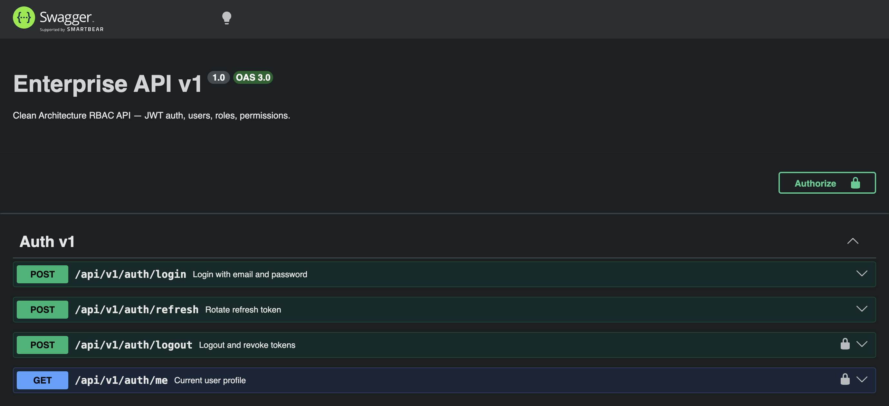
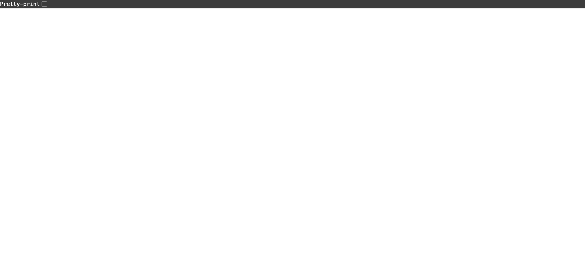
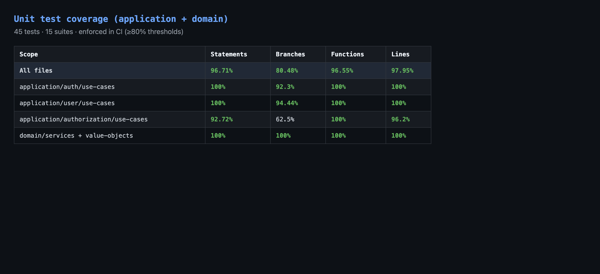

# Backend Nest — Enterprise API (Clean Architecture)

[](https://github.com/devTugu/nestjs-fsd-template/actions/workflows/ci.yml)
[](LICENSE)
[](https://github.com/devTugu/nestjs-fsd-template/actions/workflows/ci.yml)

Production-oriented **NestJS** REST API with **Clean Architecture**, **JWT authentication**, **RBAC**, **Redis** (token blacklist + permission cache), and **MySQL**.

---

## Architecture

```
src/
├── domain/              # Entities, repository interfaces, domain services (no Nest/ORM)
├── application/         # Use cases, ports, application exceptions
├── infrastructure/      # TypeORM, Redis, JWT/bcrypt adapters, migrations, seed
├── presentation/http/   # Controllers (v1), guards, filters, DTOs
└── shared/              # Constants, shared types
```

**Dependency rule:** `presentation` → `application` → `domain` ← `infrastructure`

See [docs/adr/001-clean-architecture.md](docs/adr/001-clean-architecture.md), [docs/adr/002-api-versioning.md](docs/adr/002-api-versioning.md), [docs/adr/003-audit-logging.md](docs/adr/003-audit-logging.md), and [docs/adr/004-redis-and-cache.md](docs/adr/004-redis-and-cache.md).

Additional guides: [Production](docs/PRODUCTION.md) · [Security](docs/SECURITY.md) · [Contributing](docs/CONTRIBUTING.md)

---

## Gallery

| Swagger (`/docs`) | Health readiness | Unit test coverage |
|---|---|---|
|  |  |  |

Coverage badge reflects **application + domain** layers (~98% lines); CI enforces ≥80% thresholds on those paths.

---

## Tech stack

| Category | Technology |
|----------|------------|
| Framework | NestJS 11 |
| Architecture | Clean Architecture (layered) |
| Database | MySQL 8 + TypeORM migrations |
| Cache | Redis 7 (or in-memory when `REDIS_ENABLED=false`) |
| Auth | JWT + refresh rotation + Redis blacklist |
| API | URI versioning `/api/v1/*` |
| Docs | Swagger at `/docs` (optional) |

---

## Local setup (XAMPP)

### Prerequisites

- Node.js 18+
- MySQL 8 (XAMPP or Docker)
- Redis 7 (optional — set `REDIS_ENABLED=false` for in-memory cache)

### 1. Install dependencies

```bash
npm install
```

### 2. Environment

```bash
cp .env.example .env
```

Required: `DB_*`, `JWT_*` (min 32 chars)

For Redis (recommended):

```
REDIS_ENABLED=true
REDIS_URL=redis://localhost:6379
```

For XAMPP-only dev without Redis:

```
REDIS_ENABLED=false
```

XAMPP MySQL example:

```
DB_HOST=localhost
DB_PORT=3306
DB_USERNAME=root
DB_PASSWORD=
DB_NAME=app_db
```

### 3. Redis (Docker alternative)

```bash
docker compose -f docker-compose.dev.yml up -d
```

### 4. Migrations and seed

```bash
npm run migration:run
npm run seed
```

Default admin: `admin@example.com` / `Admin123!` (override via `SEED_ADMIN_*`).

### 5. Run

```bash
npm run start:dev
```

- API base: `http://localhost:3000/api/v1`
- Swagger: `http://localhost:3000/docs` (if `SWAGGER_ENABLED=true`)

---

## API overview (v1)

| Area | Endpoints |
|------|-----------|
| Auth | `POST /api/v1/auth/login`, `refresh`, `logout`, `GET me` |
| Users | `CRUD /api/v1/users` |
| Roles | `CRUD /api/v1/roles`, `POST assign`, `DELETE assign/:userId/:roleId` |
| Permissions | `CRUD /api/v1/permissions` |
| Health | `GET /api/v1/health/live`, `GET /api/v1/health/ready` |

Auth header: `Authorization: Bearer <accessToken>`

### Permission codes (seeded)

| Code | Area |
|------|------|
| `USER_READ`, `USER_CREATE`, `USER_UPDATE`, `USER_DELETE` | Users |
| `ROLE_READ`, `ROLE_CREATE`, `ROLE_UPDATE`, `ROLE_DELETE` | Roles |
| `PERMISSION_READ`, `PERMISSION_CREATE`, `PERMISSION_UPDATE`, `PERMISSION_DELETE` | Permissions |

---

## Production (Docker)

```bash
docker compose up -d --build
```

- Runs migrations on container start (`scripts/docker-entrypoint.sh`)
- Requires MySQL + Redis services in compose
- Set `SWAGGER_ENABLED=false` in production `.env`

---

## Scripts

| Command | Description |
|---------|-------------|
| `npm run start:dev` | Development watch |
| `npm run build` | Compile |
| `npm run start:prod` | Run `dist/main.js` |
| `npm run migration:run` | Apply migrations |
| `npm run migration:generate --name=Name` | Generate migration |
| `npm run seed` | Seed roles, permissions, admin |
| `npm test` | Unit tests |
| `npm run test:e2e` | E2E (requires DB + Redis) |
| `npm run test:cov` | Coverage report |
| `npm run lint` | ESLint |

---

## Production readiness checklist

- [ ] `NODE_ENV=production`, `SWAGGER_ENABLED=false`
- [ ] `REDIS_ENABLED=true` with shared Redis for multi-instance deploys
- [ ] Strong JWT secrets (32+ chars), not committed to git
- [ ] Migrations applied before app start
- [ ] Health probes: `/api/v1/health/live`, `/api/v1/health/ready`
- [ ] CORS locked to frontend origin
- [ ] CI green: lint, migrate, seed, unit tests (~98% coverage on application + domain), e2e, build

Details: [docs/PRODUCTION.md](docs/PRODUCTION.md) and [docs/SECURITY.md](docs/SECURITY.md).

---

## CI

GitHub Actions: lint → migrate → seed → test (coverage) → e2e → build (MySQL + Redis services).

---

## Verification (release gate)

```bash
npm ci && npm run lint && npm run migration:run && npm test -- --coverage && npm run test:e2e && npm run build
```

## Pairing with the frontend

| Backend | Frontend |
|---------|----------|
| [nestjs-fsd-template](https://github.com/devTugu/nestjs-fsd-template) | [nextjs-fsd-template](https://github.com/devTugu/nextjs-fsd-template) |
| Port `3001` (local) | Port `3000` |
| Issues access + refresh tokens | Bearer JWT + RBAC-gated admin UI |

---

## Releases

Latest: **[v0.1.0](https://github.com/devTugu/nestjs-fsd-template/releases/tag/v0.1.0)** — first stable template release (Clean Architecture, RBAC, Redis, ~98% app/domain coverage).

Pair with [nextjs-fsd-template v0.1.0](https://github.com/devTugu/nextjs-fsd-template/releases/tag/v0.1.0).

---

## Article (dev.to)

Draft for publishing: [docs/articles/full-stack-rbac-starter-devto.md](docs/articles/full-stack-rbac-starter-devto.md)

Copy the markdown body into [dev.to/new](https://dev.to/new) (update `canonical_url` and `YOUR_USERNAME` in frontmatter).

---

## Adding a feature

See [docs/CONTRIBUTING.md](docs/CONTRIBUTING.md).

---

## License

[MIT](LICENSE)
